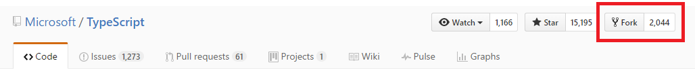
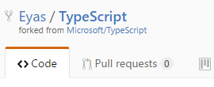
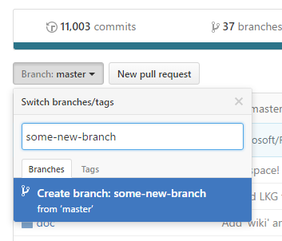

# GitHub for Content Editors

This document describes how content editors unfamiliar with git, GitHub, and markdown can contribute markdown content to GitHub repositories. This document does not cover using git or cloning a repository locally.

## Forking a Repository

To contribute to a public repository most effectively, you will likely need to **fork** it. This allows you to have a copy of the repository that you can write your content in, manage revisions, create different branches, etc. When you are satisfied with the state of a particular **branch** of your own repository, you submit a **Pull Request** which is effectively a request for someone with _commit privileges_ to merge your changes back into the master branch at the main repository.

The "main" repository will show up as "<organization>/<repository>", while your forked repository will show up as "<your username>/<repository>".

Since you "own" this _forked_ repository, you will be able to create branches on this repository just fine.

To create a branch in your own repository, click on the dropdown box labeled "**Branch: master**" and type in the name of a new branch. When that name doesn't match an existing branch, GitHub will suggest you create a new one.

Why create new branches? It makes it easier to separate each of your edits into different "topics". Merging back your changes into GitHub happens on a branch-by-branch basis, so this allows you to work multiple articles at the same time, and only merge back the branches that are ready.

## Writing content in your branch

Content and edits to content make their way to a branch as **commits**. A commit is a cohesive collection of changes that modify a project.

How to commit make changes to a branch? A few ways:

1. **The GitHub.com site** provides a basic editor online. You can navigate the folder structure there. Make sure that you are switched to the appropriate branch first, corresponds to the set of work you are about to make. Navigate to the folder you are interested in. There, you can go to an existing file and click the pen icon to edit it, or you can click the "Create new file" button to make a new file. before saving, GitHub will ask you to write an ew commit message, and whether you want to commit directly to your branch, or create a new branch and start a pull request. For now, just keep committing to your branch and save your progress that way.

2. **An online editor like prose.io**. A website like [prose.io](http://prose.io/) which connects to your GitHub accounts and provides an editor there. Again, make sure you are on the correct branch (you can choose the branch by using the "switch branch" dropdown on the right hand pane). Clicking the "Save" icon in prose will commit to that branch.

3. If you would like to keep in-progress `.md` documents on your computer. You can clone the repository and use any text editor to create new markdown files. You will need to have a local git client installed, add and commit these files, and then push them to your repository. This the more advanced option for those unfamiliar with using git, but is also the option that gives you the most flexibility.

## Submitting Pull Requests

When you are satisfied with your progress, you can submit a pull request by hitting the "New pull request" button anywhere on your repository. Then choosing the right source and destination branches. See GitHub's [Creating a Pull Request](https://help.github.com/articles/creating-a-pull-request/) and [About pull requests](https://help.github.com/articles/about-pull-requests/) help topics for additional help. From these pages, you can also find a description of what your _base_ and _compare_ branches should be:

> 4. Use the base branch dropdown menu to select the branch you'd like to merge your changes into, then use the compare branch drop-down menu to choose the topic branch you made your changes in.

A Pull Request is "live" in a sense, meaning that, as people give you feedback, you might add additional comments/edits. Any edit you make the branch you're pulling _from_ will be added to the pull request automatically. Be sure to only commits pending work to _other_ branches, so that your Pull Request for one topic doesn't get commits about other topics added to it.

## Mastering Markdown

GitHub provides an excellent guide, [Mastering Markdown](https://guides.github.com/features/mastering-markdown/). See also the [Markdown Cheatsheet](https://github.com/adam-p/markdown-here/wiki/Markdown-Cheatsheet) by adam-p.
